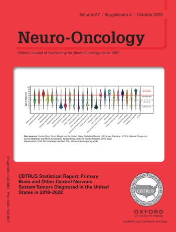
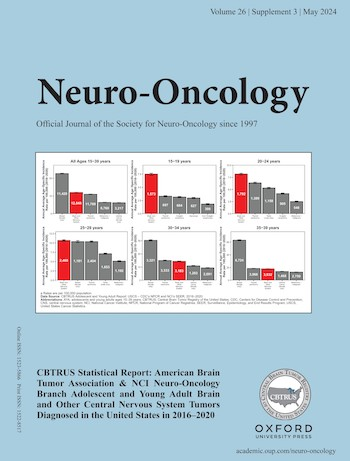
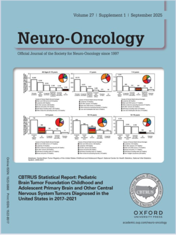

# Research

The overall goal of the Ostrom Lab is to advance the field of neuroepidemiology by uncovering the factors that drive the development and progression of both primary and metastatic brain tumors. Through integrative, data-driven research, we aim to identify at-risk populations in hopes to eventually enable targeted screening, early detection, and ultimately prevention.

We are a collaborative, multidisciplinary research program that serves as a hub for large-scale epidemiologic discovery, bringing together population science, clinical research, and laboratory investigation to accelerate improvements in brain tumor outcomes.

## Research Focus Areas
Our work spans several interconnected areas:

* Population-based cancer surveillance and leadership of CBTRUS data analysis
* Genetic ancestry and cancer disparities in glioma
* Immunoepidemiology of glioma 
* Epidemiology and outcomes of metastatic brain tumors
* Pharmacoepidemiology and drug repurposing for glioma
* Real-world data (RWD) methods development 

We leverage diverse data sources—including cancer registries, genomic datasets, electronic health records, and insurance claims—to conduct rigorous, high-impact analyses that inform both biology and clinical care.

## Current Research Themes
### Population-based statistics for brain tumors
A central pillar of our research program is leadership of the data analysis center for the [Central Brain Tumor Registry of the United States (CBTRUS)](http://cbtrus.org), which captures data on approximately 99.9% of newly diagnosed brain tumors nationwide. Through CBTRUS, we produce the annual statistical report published in *Neuro-Oncology* and related scientific manuscripts. These data provide a critical foundation for hypothesis generation, enabling identification of demographic and geographic patterns in brain tumor incidence and survival.
Our group also develops analytic tools and resources for the field, including methods for estimating complete cancer prevalence (e.g., [prevEst](https://github.com/ostrom-lab/prevEst)) and harmonization of brain tumor classification to support reproducible research.

Please see our most recent CBTRUS statistical reports:

<b>CBTRUS Statistical Report: Primary Brain and Other Central Nervous System Tumors Diagnosed in the United States in 2018-2022</b> 
The annual CBTRUS statistical report provides the most up-to-date, comprehensive data on how often brain tumors occur in the United States and how incidence, survival, and mortality vary across different populations.
<a href="http://doi.org/10.1093/neuonc/noaf194">Neuro Oncol. 2025 Oct 14;27(Supplement_4):iv1-iv66</a>.

<b>CBTRUS Statistical Report: American Brain Tumor Association & NCI Neuro-Oncology Branch Adolescent and Young Adult Primary Brain and Other Central Nervous System Tumors Diagnosed in the United States in 2016-2020</b> 
This national report, funded by the National Cancer Institute and the American Brain Tumor Association, provides a comprehensive overview of brain tumor patterns in adolescents and young adults, highlighting unique disease characteristics and persistent gaps in survival for this population.
<a href="http://doi.org/10.1093/neuonc/noae04">Neuro Oncol. 2024 May 6;26(Supplement_3):iii1-iii53</a>.

<b>CBTRUS Statistical Report: Pediatric Brain Tumor Foundation Childhood and Adolescent Primary Brain and Other Central Nervous System Tumors Diagnosed in the United States in 2017-2021</b> 
This national report, supported by the Pediatric Brain Tumor Foundation, provides comprehensive, population-based data on brain tumors in children and adolescents in the United States, highlighting their incidence, outcomes, and substantial impact as the leading cause of cancer-related death in this age group.
<a href="http://doi.org/10.1093/neuonc/noaf168">Neuro Oncol. 2025 Sep 15;27(Supplement_1):i1-i42</a>.

### Genetic and social drivers of disparities in brain tumors
Our research has helped define the role of genetic ancestry in glioma risk and survival, including early identification of survival disparities and the contribution of European ancestry to glioma susceptibility. We are leading efforts to conduct large-scale, multi-ancestry genomic studies and integrate GWAS data with single-cell and functional datasets to identify biological drivers of disparity. 

Please see representative publications below:  

<b>Influence of Geographic/Ancestral Origin on Glioma Incidence and Outcomes in US Hispanics</b> 
Using population-based data, we shows that glioma risk and survival differ within U.S. Hispanic populations depending on geographic and predominant ancestral background, highlighting important genetic and population diversity that influences brain tumor risk and outcomes. 
<a href="http://doi.org/10.1093/neuonc/noac175">Neuro Oncol. 2023 Feb 14;25(2):398-406</a>.

<b>Glioma Risk Associated with Extent of Estimated European Genetic Ancestry in African Americans and Hispanics</b> 
This study shows that individuals with greater European genetic ancestry have a higher risk of developing glioma among African American and Hispanic populations, highlighting population variation in inherited genetic susceptibility to glioma. 
<a href="http://doi.org/101002/ijc32318">Int J Cancer 2020 Feb 1;146(3):739-748</a>.

<b>Adult Glioma Incidence and Survival by Race or Ethnicity in the United States from 2000 to 2014</b> 
In this large population-based study, we show that glioma incidence and survival differ across racial and ethnic groups in the United States, with higher incidence but often poorer survival observed among non-Hispanic White patients compared to other groups. 
<a href="http://doi.org/101001/jamaoncol20181789">JAMA Oncol 2018 Sep 1;4(9):1254-1262</a>.

 

### Immunoepidemiology of glioma
A major focus of our program is understanding the relationship between immune function and glioma risk and outcomes. Current work aims to define the mechanisms underlying these associations and extend these approaches to brain metastases, where immune-related risk and survival patterns remain poorly understood.

Please see representative publications below:  

<b>Partitioned glioma heritability shows subtype-specific enrichment in immune cells</b> 
We show that genetic factors linked to immune system activity and autoimmune conditions are associated with a lower risk of glioma, suggesting that stronger immune responses may help protect against brain tumors. 
<a href="http://doi.org/101093/neuonc/noab072">Neuro Oncol 2021 Aug 2;23(8):1304-1314</a>.

<b>Prevalence of autoimmunity and atopy in US adults with glioblastoma and meningioma</b> 
Examining national private payer insurance claims, we identify decreased frequency of pre-diagnostic claims associated with autoimmune and allergic disease in individuals diagnosed with glioma. 
<a href="http://doi.org/10.1093/neuonc/noac145">Neuro Oncol. 2022 Oct 3;24(10):1807-1809.</a>.

### Epidemiology of brain metastases
Metastatic brain tumors are the most common tumors affecting the central nervous system but remain understudied from an epidemiologic perspective. Our research focuses on identifying patients at highest risk for developing brain metastases and understanding factors that influence outcomes across cancer types.

Please see representative publications below:  

<b>Epidemiology and Survival of Adolescents and Young Adults with Brain Metastases Versus Older Adults </b> 
Compares adolescent and young adult patients with brain metastases to older adults, showing distinct epidemiologic patterns and generally poorer survival outcomes despite broader improvements in cancer survival 
<a href="http://doi.org/10.1007/s11060-025-05332-2">J Neurooncol. 2025 Nov 12;176(1):81.</a>.

<b>Atopy Improves Survival and Decreases Risk of Brain Metastasis in Cutaneous Melanoma </b> 
Using Medicare claims linked to cancer registry data, we show that people with a history of allergic conditions have better survival and a lower likelihood of developing brain metastases after melanoma, suggesting that immune system activity may influence metastatic as well as primary CNS tumors.
<a href="http://doi.org/10.1158/1055-9965.EPI-24-1212">Cancer Epidemiol Biomarkers Prev. 2025 Sep 2;34(9):1600-1608.</a>.

### Real-world data and methods development
We are developing methodologies to improve the use of real-world data (RWD) in neuro-oncology research. These data sources provide critical insights into treatment patterns and outcomes at population scale. Ongoing work includes development of clinically meaningful endpoints for glioblastoma, evaluation of RWD as external controls for clinical trials, and establishment of best practices for rigorous, reproducible RWD analyses.

Please see representative publications below:  

<b>Complete Prevalence of Primary Malignant and Non-Malignant Brain Tumors in Comparison to Other Cancers in the United States</b> 
This analysis included the first complete estimates for the prevalence of both primary malignant and non-malignant brain and other central nervous system tumors in the United States as of 2019, an update to previous results.
<a href="http://doi.org/10.1002/cncr.34837">Cancer. 2023 Aug 15;129(16):2514-2521.</a>.

### Pharmacoepidemiology and drug repurposing
Building on our RWD infrastructure, we are conducting studies to identify existing medications with potential benefit for glioma treatment. This work integrates pharmacoepidemiologic methods with causal inference approaches, including target trial emulation, to systematically evaluate drugs as candidates for repurposing.

Please see representative publications below:  

<b>Gabapentin Repurposing for Glioblastoma Therapy: Real-World Data Analyses Augmented by Use of Active Comparators.</b> 
Using large real-world data, we evaluated whether the commonly used medication gabapentin may improve survival in glioblastoma patients, highlighting its potential for drug repurposing in brain cancer treatment.
<a href="http://doi.org/10.1093/neuonc/noaf280">Neuro Oncol. 2026 Apr 1;28(4):1078-1080.</a>.

